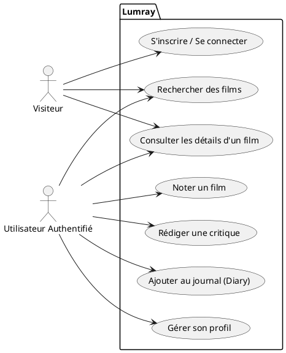
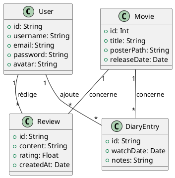
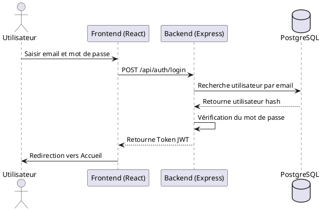
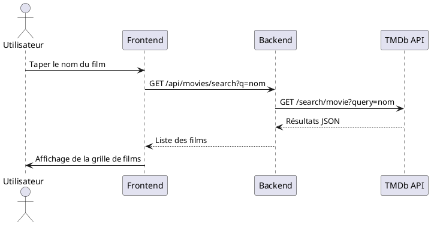
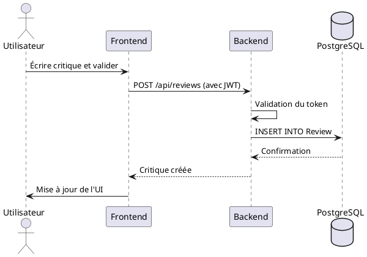
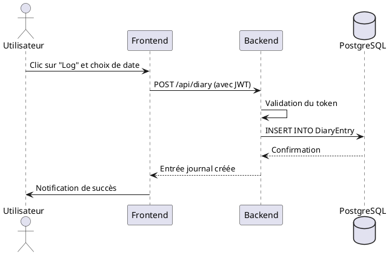

# RAPPORT DE PROJET DE FIN D'ÉTUDES

**Projet : Lumray - Plateforme Communautaire de Cinéma**

---

## REMERCIEMENTS

Je tiens tout d'abord à exprimer ma sincère gratitude envers mon encadrante, **Mme Elkandoussi Oufae**, pour ses conseils avisés, sa disponibilité et son soutien tout au long de la réalisation de ce projet. Ses remarques pertinentes et son accompagnement ont été déterminants dans l'avancement de ce travail.

Je remercie également l'ensemble du corps professoral de **ISTA CITÉ DE L’AIR** pour la qualité de la formation dispensée et pour nous avoir préparés aux défis du monde professionnel.

Mes remerciements s'adressent aussi à mes coéquipiers sur le projet Lumray pour leur confiance, leur collaboration et leur investissement tout au long du développement de cette application.

---

## RÉSUMÉ

Ce rapport présente le travail réalisé dans le cadre du Projet de Fin d'Études : le développement de **Lumray**, une plateforme communautaire de catalogage et d'évaluation de films (inspirée de Letterboxd).

Le contexte de ce projet part d'un constat simple : les passionnés de cinéma ont besoin d'un espace interactif et structuré pour enregistrer les films qu'ils ont vus, rédiger des critiques, découvrir de nouvelles œuvres et échanger avec d'autres cinéphiles. Lumray vient digitaliser et enrichir cette expérience en proposant un portail centralisé et social.

L'application repose sur une architecture moderne : un frontend **Next.js/React** en **TypeScript** avec **Zustand** pour la gestion d'état et **Tailwind CSS** pour le style, et un backend en **Node.js/Express**, avec **PostgreSQL** comme base de données et **Prisma** comme ORM. L'authentification est sécurisée par JWT, et le système inclut une intégration poussée avec l'API TMDb pour les métadonnées de films, la gestion des profils utilisateurs, un journal de visionnage (diary), et un flux d'activité communautaire.

---

## TABLE DES MATIÈRES

1. [01 Introduction générale](#01-introduction-générale)
2. [02 Chapitre 1 : Présentation du projet](#02-chapitre-1--présentation-du-projet)
3. [03 Chapitre 2 : Conception](#03-chapitre-2--conception)
4. [04 Chapitre 3 : Outils et technologies utilisés](#04-chapitre-3--outils-et-technologies-utilisés)
5. [05 Chapitre 4 : Réalisation](#05-chapitre-4--réalisation)
6. [06 Conclusion générale](#06-conclusion-générale)
7. [07 Bibliographie](#07-bibliographie)

---

## 01 Introduction générale

Le domaine du divertissement et du cinéma génère un volume d'informations massif. Pour les cinéphiles, il devient essentiel de disposer d'outils permettant de conserver une trace de leurs visionnages et de partager leurs avis. Ce projet de fin d'études a pour but de concevoir et de développer Lumray, une application web full-stack répondant à ces besoins. Ce rapport détaille les différentes phases du cycle de vie du projet, de l'étude des besoins à la réalisation technique.

---

## 02 Chapitre 1 : Présentation du projet

### Contexte
Lumray est né de la volonté de créer un réseau social dédié au cinéma. L'objectif est de fournir aux utilisateurs un carnet de bord numérique ("Diary") pour leurs films, tout en favorisant les interactions sociales via des critiques, des notes et des listes personnalisées.

### Objectifs
- **Tier 1 (Essentiel) :** Authentification, recherche de films via l'API TMDb, consultation des détails d'un film, notation, rédaction de critiques, et journal de visionnage (Diary).
- **Tier 2 (Important) :** Suivi d'utilisateurs (Follow), flux d'activité, création de listes personnalisées, et publications communautaires.
- **Tier 3 (Optionnel) :** Messagerie en temps réel, tableau de bord statistique, et recommandations de films.

---

## 03 Chapitre 2 : Conception

### Architecture globale
L'application adopte une architecture en monorepo contenant deux projets distincts qui ne partagent aucun code : le frontend (Lumray Web) et le backend (Lumray API). La communication s'effectue exclusivement via des requêtes HTTP (Axios) avec un format de réponse standardisé (`{ data, error, message }`). De plus, pour optimiser les performances et limiter les requêtes externes, une stratégie de **mise en cache paresseuse (lazy caching)** a été implémentée : chaque requête de film vérifie d'abord la base de données locale (PostgreSQL) avant d'interroger l'API TMDb.

### Modélisation de la base de données
La base de données relationnelle est structurée autour de plusieurs entités principales :
- **Utilisateurs (User) :** Gestion des comptes et profils.
- **Films et Casting :** Mise en cache des données récupérées depuis TMDb (Movie, Person, Genre).
- **Activité Utilisateur :** Rating, Review, DiaryEntry, List, ListItem.
- **Aspect Social :** Follow (relations entre utilisateurs), Post, Comment, Like.

### Maquettage
Les interfaces ont été conçues sur Figma, en priorisant une esthétique moderne et "dark mode" (fonds sombres, accents violets) pour mettre en valeur les affiches de films.

### Diagrammes UML

#### 1. Diagramme de Cas d'Utilisation (Use Case)

#### 2. Diagramme de Classes

#### 3. Diagrammes de Séquence

**Séquence 1 : Authentification (Login)**

**Séquence 2 : Recherche de Film**

**Séquence 3 : Ajout d'une Critique (Review)**

**Séquence 4 : Ajout au Journal (Diary)**

---

## 04 Chapitre 3 : Outils et technologies utilisés

Le choix des technologies s'est porté sur une stack moderne, robuste et scalable :

**Frontend :**
- **Next.js 14 (App Router) & React :** Framework pour l'interface utilisateur.
- **TypeScript :** Pour un typage strict et une meilleure maintenabilité.
- **Tailwind CSS :** Pour un styling utilitaire rapide et responsive.
- **Zustand :** Pour la gestion d'état global.
- **Axios :** Pour les requêtes HTTP.

**Backend :**
- **Node.js & Express :** Pour la création de l'API REST.
- **TypeScript :** Pour la cohérence avec le frontend.
- **Prisma :** ORM (Object-Relational Mapping) moderne.
- **JWT & bcryptjs :** Pour l'authentification et la sécurité.

**Base de données & Services :**
- **PostgreSQL :** Base de données relationnelle hébergée sur Neon.
- **TMDb API :** Fournisseur externe pour les données de films (affiches, casting, synopsis).
- **Vercel & Render :** Plateformes pour le déploiement continu du frontend et du backend.

---

## 05 Chapitre 4 : Réalisation

### Phase de développement et Rôle Personnel
Le travail a été divisé entre les membres de l'équipe pour paralléliser les tâches. En tant que développeur sur ce projet, je suis intervenu de manière full-stack, en travaillant très souvent sur la création d'**endpoints backend** ainsi que sur la réalisation et l'assemblage de **composants frontend** :
1. **Création des composants UI (Frontend) :** Développement de composants réutilisables (Boutons, Cartes de films, Modales, Étoiles de notation) en respectant un design system précis (Tailwind).
2. **Développement de l'API (Backend) :** Mise en place des routes (avec JWT et argon2), intégration de TMDb avec cache, et création des endpoints CRUD en assurant un format de réponse strict.
3. **Déploiement Cloud :** Déploiement de l'ensemble de l'infrastructure sur le cloud en utilisant **Vercel** pour le frontend, **Render** pour le backend, et **Neon** pour la base de données PostgreSQL serverless.

### Fonctionnalités clés implémentées
- Interface de recherche de films en temps réel connectée à TMDb.
- Page de détails de film riche avec casting, affiches, et distribution des notes de la communauté.
- Système d'authentification sécurisé et gestion de profils.
- Tableau de bord utilisateur listant les films vus et les statistiques associées.

---

## 06 Conclusion générale

Le développement de Lumray a permis de mettre en pratique l'ensemble des connaissances acquises durant notre formation à l'ISTA CITÉ DE L’AIR. La réalisation d'une application full-stack complète, de la conception de la base de données au déploiement, en passant par l'intégration d'API externes complexes comme TMDb, a été extrêmement formatrice. Le projet respecte le cahier des charges initial et offre une base solide pour de futures évolutions telles que l'ajout d'une messagerie en temps réel.

---

## 07 Bibliographie

1. Documentation officielle Next.js : [https://nextjs.org/docs](https://nextjs.org/docs)
2. Documentation Prisma ORM : [https://www.prisma.io/docs](https://www.prisma.io/docs)
3. The Movie Database (TMDb) API Documentation : [https://developers.themoviedb.org/3](https://developers.themoviedb.org/3)
4. Tailwind CSS Documentation : [https://tailwindcss.com/docs](https://tailwindcss.com/docs)
